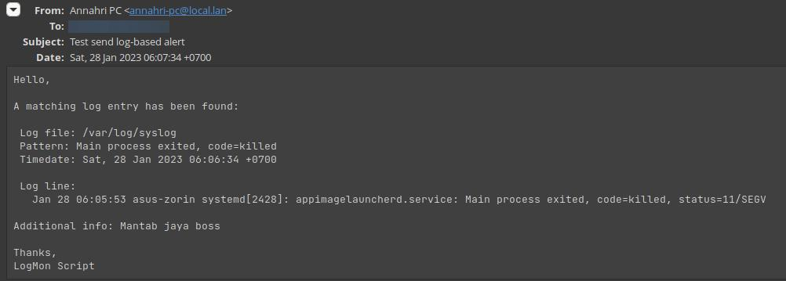

# Log Mandor

log-mandor.sh is a Bash script which allows you to monitor a log file and sends an alert if the matching pattern found.


## Requirements

1. Bash 5.0 or greater
2. Sendmail

## Installation

Just simply put the script in a directory recogized by your PATH variable and make it executable.

## Usage

```plain
log-mandor.sh - Monitors a log file and sends an alert when a matching pattern found.
Usage: log-mandor.sh <flags>

Mandatory flags:
 -f FILE    
    Log file to monitor
 -t SECONDS 
    Set the alerting grace time
 -p PATTERN 
    Regex pattern to match against the log line

 -T ADDR    
    Specify the recipient email address.
    Also supports this format: Name <address@domain.tld>
 -F ADDR    
    Specify the sender address
    Also supports this format: Name <address@domain.tld>
 -S STRING  
    Email subject for the alert email

Optional flags:
 --add-note NOTES
    Adds additional notes to the end of the alert body

Other flags:
 -s Interactively sets up a systemd service
 -h Show this help info
```

### Example

```bash
./log-mandor.sh -f /var/log/syslog -p 'Main process exited, code=killed' -t 60 -T 'recipient@domain.tld' -F 'Annahri PC <annahri-pc@local.lan>' -S "Test send log-based alert" --add-note "Mantab jaya boss"
```
The example above will monitor `/var/log/syslog` and if there's a line that matches the pattern "Main process exited, code=killed", it will send an email to `recipient@domain.tld` with subject "Test send log", and with additional note "Mantab jaya boss". The `-t 60` means, if there are more log entry within 60 seconds, only the very first will be alerted.

Example email alert:



### Creating systemd service

You can also create a systemd service unit by doing:

```
./log-mandor.sh -s
```

It will prompt you the required values, and it will create the daemonized version that you can start using:

```
systemctl start logmandor-{name}
systemctl stop logmandor-{name}
```
### Using GMAIL as relay

You can follow this tutorial to setup Gmail as SMTP relay:

- [Configure Sendmail to Relay Emails through Gmail SMTP](https://tecadmin.net/sendmail-to-relay-emails-through-gmail-stmp/)

## Todo

- [ ] HTML-formatted email
- [ ] Support other MTAs
- [ ] Extract values from the log entry
- [ ] ...
